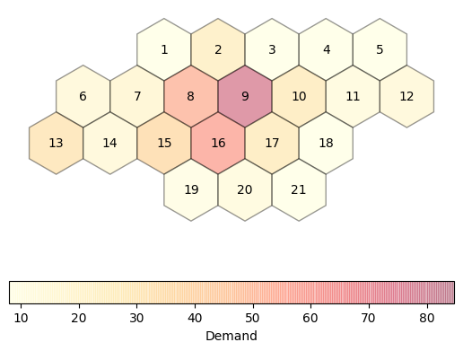
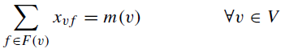
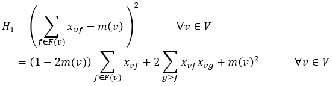
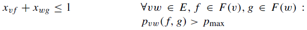

# Frequency Selection

Frequency selection problems have to do with assigning frequencies to
transmitting and receiving stations for wireless communication.  Various problem
definitions have been discussed in the literature (see, for example,
Ref. [[1]](#1)), but the problems generally involve choosing the frequencies
subject to constraints associated with interference.  Interference occurs when
nearby stations use frequencies that are close together.

In this example, we consider the "feasibility frequency assignment problem"
[[1]](#1).  In this problem, there is a set of stations to which frequencies
must be assigned, and a set of available frequencies, and the goal is to
identify frequency assignments that satisfy two constraints:

- Constraint 1: Each station is assigned the number of frequencies it requires,
  referred to as the demand.
- Constraint 2: No interference occurs.

Interference can be defined in terms of a forbidden set of frequency differences
associated with stations.  For example, the problem may specify that frequencies
assigned to the same station must differ by at least 5, whereas frequencies
assigned to adjacent stations must differ by at least 2.

This example makes use of the Philadelphia benchmark instances introduced by
Ref. [[2]](#2).  These problem instances involve a hexagonal grid with 21
stations, as shown below.  Nine different problem instances are defined, labeled
"P1" through "P9", which each have associated demand and interference ("reuse
distance") specifications.  The schematic below is colored according to the
demand values for problem instance P1.  Further details are given in Refs.
[[2](#2),[3](#3)].



The Philadelphia instances have been widely used to study the minimum span
frequency assignment problem -- this is the problem of finding frequency
assignments that satisfy the constraints defined above while minimizing the
difference between the highest and lowest frequencies used.  Summaries of
reported results can be found at http://fap.zib.de/problems/Philadelphia/
[[3]](#3).  One can view feasibility frequency assignment as a subproblem of
minimum span frequency assignment, in which the feasible solution is searched
for using increasingly smaller sets of candidate frequencies.


## Usage

To run the demonstration, execute:

```bash
python frequency.py --show-plot
```

Or:

```bash
python frequency.py --save-plot
```

This loads the default small problem, which uses only a subset of the stations
from the full Philadelphia instance and reduces the demands.  The optional
`--show-plot` (display interactive plot using Matplotlib) and `--save-plot`
(save to file) flags create a plot of the stations, colored by their relative
demands.  Any constraint violations (either demand or interference) are
indicated by a hash fill pattern in the cells corresponding to the station in
which a constraint was violated.

To run the analysis for the full "P1" Philadelphia problem instance, execute:

```bash
python frequency.py P1
```

For each available problem definition, a default value is defined for the number
of candidate frequencies.  This can be overridden using the `-n` option.  Use
`python frequency.py -h` for a description of all command options and available
problems.


## Code Overview

The code consists of the following steps:

1. Based on the user input, the problem specification is loaded, which defines
   the set of demand values, the reuse distances, and the total number of
   available frequencies.
2. A binary quadratic model is constructed to represent the problem definition.
   The objective function is formed by encoding all of the constraints as
   penalty functions.
3. The problem is solved using a combination of classical and quantum computing
   resources with Leap's hybrid BQM solver.
4. Information about the feasibility of the solution is printed to the screen,
   optionally displaying a plot of the stations to indicate any constraint
   violations.


## Code Specifics

The formulation of the feasibility frequency assignment problem as a constraint
satisfaction problem with binary variables is discussed in Ref. [[1]](#1).  The
binary variables are denoted by `x_{vf}`, which are indicators for whether
frequency `f` is selected for station `v`.  The constraint satisfaction problem
is formulated as a binary quadratic model by constructing an objective function
that includes a penalty whenever a constraint is violated.

Mathematically, the constraint to meet the given demand at each station is
specified as:



where `m(v)` denotes the demand at station `v`. The penalties associated with
the demand constraints can be formed by squaring the difference between the
selected and demanded number of frequencies at each station:



To account for the interference constraint, the following inequality is applied
for all pairs of selections `x_{vf}` and `x_{gw}` that would result in
interference:



These inequalities are incorporated into the binary quadratic model by assigning
a positive interaction coefficient to all pairs of binary variables that produce
interference.


## References

<a name="1">[1]</a> Aardal, K.I., van Hoesel, S.P.M., Koster, A.M.C.A. et al. Models and
solution techniques for frequency assignment problems. 4OR 1, 261–317,
2003. https://doi.org/10.1007/s10288-003-0022-6.

<a name="2">[2]</a> Anderson, LG. A simulation study of some dynamic channel assignment
algorithms in a high capacity mobile telecommunications system. IEEE
Transactions on Communications 21, 1294– 1301, 1973.

<a name="3">[3]</a> URL: http://fap.zib.de. Maintained by A. Eisenblätter and
A. M. C. A. Koster.


## License

Released under the Apache License 2.0. See [LICENSE](LICENSE) file.
